## Glibc
	Glibc (GNU C Library) က Linux operating system အတွက် standard C library အဓိကတစ်ခုဖြစ်။ 

```
Glibc က 4 အဓိက လုပ်ဆောင်ချက်တွေလုပ်ပေးတယ်:

1. System Calls Wrapper
   └── User code → Glibc → Kernel system calls
   └── Example: printf() → write() system call

2. Standard C Library Implementation  
   └── ISO C Standard အကုန်လုံးပါ
   └── printf(), malloc(), strcpy(), fopen(), etc.

3. POSIX Compliance (Unix Standard)
   └── fork(), exec(), pthread_create(), socket()
   └── မတူတဲ့ Unix systems တွေမှာ တူညီတဲ့ interface

4. Memory Management (Heap Allocator)
   └── malloc(), free(), calloc(), realloc()
   └── ptmalloc2 algorithm သုံးထားတယ်
```
	check glibc version with
	 ldd --version


	challenge တွေဖြေတဲ့အခါမှာ တစ်ခါတစ်လေ libc version တူပေမဲ့ offset တွေကွဲနေတတ်တယ် ဆိုတော့ be careful . ဘာလို့ မတူလဲဆို

1. **Different Build Configurations**  
    libc ကို compile တဲ့အခါ configuration options တွေ (ဥပမာ: `--enable-debug`, `--with-float`, threading model) ပေါ်မူတည်ပြီး symbol offsets တွေပြောင်းသွားနိုင်တယ်။
    
2. **Patch Level ကွာခြားမှု**  
    glibc 2.23 ထဲမှာတောင် security patches, bug fixes တွေအမျိုးမျိုးရှိတယ်။ အဲ့တာတွေကလည်း offsets တွေကိုပြောင်းစေနိုင်တယ်။
    
3. **Architecture/Platform Differences**  
     libc နှစ်ခုကို မတူတဲ့ system ကနေ download လုပ်ထားတာ (သို့) compile လုပ်ထားတာ ဖြစ်နိုင်တယ်။


---

# what is Heap ??


Heap ဆိုတာက data တွေ သိမ်းဆည်းမယ့် နေရာ တစ်ခုဖြစ်ပါတယ်။  အခြေခံအားဖြင့်နားလည်ရမယ်ဆိုရင် malloc() နဲ့ data တွေအတွက်နေရာယူပြီး free() နဲ့ dataတွေကိုရှင်းလင်းပေးပါတယ်။ 
malloc() အပြင် calloc , realloc and mmemalign တွေကို အသုံးပြုလို့ရတယ်။ Heap ကို chunk တွေနဲ့တည်ဆောက်ထားပါတယ်။ 


## Memory Chunk and Chunk allocation

ဆိုတော့ ငါတို့က malloc ကို သုံးပြီး 10 byte နေရာယူမယ်ဆိုပါစို့  ဒါမဲ့ heap manager က 10 Byte ထက်ပိုတဲ့ region ကို ရှာတယ် ဘာလို့ဆို allocation related metadata ကို store လုပ်ဖို့အတွက် heap ရှေ့နေရာပိုယူတယ်
(8 bytes  for 32 bit / 16 bytes  for 64 bit)
chunk alignment လည်းများသောအားဖြင့်အဲလိုယူပါတယ်
metadata မှာက chunk size ရယ် AMP info ရယ်  prev_sizeရယ်ပါပါတယ်
‌allocate လုပ်ပြီးသွားရင်  user data ရှိတဲ့ memory address ကို return ပြန်တယ် (metadata ကစတာမဟုတ်ဘူး) ပုံမှန် အားဖြင့် eax registerထဲမှာသိမ်းတယ်


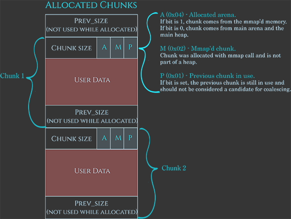

	chunk တစ်ခုမှာ အဲ chunk မတိုင်ခင် chunk ကို previous chunk လို့ခေါ်တယ်  previous chunk က free ဖြစ်နေရင် current chunk free လုပ်လိုက်တဲ့အခါ chunk နှစ်ခု ပေါင်းလို့ရတယ် (coalescing) ဆိုတော့ previous chunk freeဆိုရင် current chunk ရဲ့ prev_sizeမှာ previous chunk size ထည့်ထားတယ် free မဟုတ် ဘူးဆိုရင် prve size နေရာကို user data အဖြစ်သုံးတယ်


Malloc ကဘယ်လိုနေရာယူလဲဆိုရင်

- previously freeလုပ်ထားတဲ့ chunckတွေကို bin ထဲမှာလိုက်ရှာတယ် ကိုက် ညီတဲ့ chunk တွေ့ရင် ယူတယ် မတွေ့ရင်
- top heapမှာ နေရာအလွတ်ကျန်သေးရင် new chunk create လုပ်တယ် နေရာလွတ် မကျန်တော့ရင်
- heap manager က kernel ကို heap အစွန်းမှာ memory ထည့်ပေးဖို့တောင်းတယ် ထပ်တောင်းလို့မရတော့ရင်
- malloc return Null


## Arena 

	Arena ဆိုတာ ptmalloc2 memory allocator မှာ heap memory ကို စီမံခန့်ခွဲဖို့အတွက် သီးသန့်နေရာတစ်ခု ဖြစ်တယ်။  Multi-threading Performance အတွက်ဖြစ်တယ်။ malloc() function ကိုသုံးဖို့ဆိုရင် thread တစ်ခုချင်းစီတိုင်းက lock ယူထားတဲ့ threadကို စောင့်နေရတယ်။ ဆိုတော့ အဲလိုမစောင့်ရအောင် thread တစ်ခုချင်းစီတိုင်းကို Arena သုံးပြီး imporve performance ။ မတူညီတဲ့ Arenas သုံးလို့ lock contention နည်းတယ် ။ Arena တစ်ခုစီမှာသူ့ရဲ့ ကိုယ်ပိုင်

- **Heap memory region**
    
- **Bins (tcache, fastbin, smallbin, unsortedbin, largebin)**
    
- **Lock (mutex)**

	ပါဝင်တယ် 
	program စတာနဲ့စပြီး create လုပ်တဲ့ heap ကို main arena လို့ခေါ်တယ် Single-threaded program တွေအတွက် ဒီကောင်အဆင်ပြေတယ် sbrk()/brk() သုံးပြီး heap တိုးတယ်
	Thread အသစ်တစ်ခုစီအတွက် ဖန်တီးထားတာကို Thread Arena (Non-main Arena)/Secondary Arena လို့ခေါ်တယ် mmap()သုံးပြီး anonymous mapping လုပ်တယ် Heap memory တွေက မဆက်စပ်တဲ့နေရာမှာရှိတယ် ဒီကောင် ထဲက heap ကို sub heap လို့ခေါ်တယ် Thread အသစ်တစ်ခုစီအတွက် new arena ဖန်တီးနိုင်တယ် (large allcoation တွေအတွက် main arena ကလည်း mmap() သုံးပြီးနေရာယူပါတယ် ဒါမဲ့ sbrk()/brk() လို တစ်ဆက်တည်း မဟုတ်တော့ပါဘူး)
	ဒီနေရာမှာ secondary arena က heap နဲ့ တစ်ဆက်တည်းမဟုတ်ပါဘူး shared library region လိုနေရာမှာ memory အသစ် တစ်ခု create လုပ်သလိုဖြစ်ပါတယ် memory ပေါ်မှာ ကွက်ကြားကွက်ကြားရှိတဲ့ သဘောမျိူးပါဘဲ


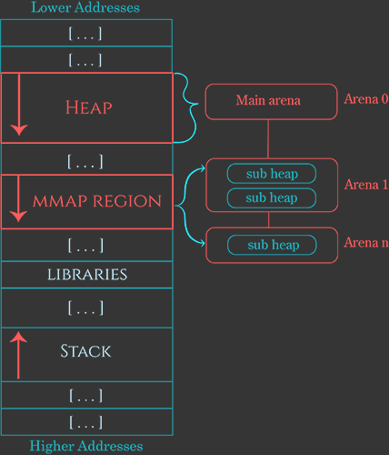


## Allocating  From  Free'd chunks (from bins)

free chunk တွေကို bins တွေထဲထည့်ထားတယ် malloc ယူတဲ့အခါ ဒီကောင်တွေကိုပြန်သုံးတယ်
free chunk မှာ user data တွေကို fd နဲ့ bk နဲ့ အစားထိုးလိုက်တယ်
bin 5 မျိုးရှိတယ် 


## 1. Tcache bin

	 Request size < 0x410 bytes ဆိုရင် malloc က ဒီကောင် ကို ပထမဆုံး check လုပ်တယ် multi-threaded program တွေမှာ heap lock contention ကိုလျှော့ချဖို့ ဒီဇိုင်းလုပ်ထားတာဖြစ်တယ် glibc malloc allocator မှာ multi-threaded performance ကိုမြှင့်တင်ဖို့အတွက် မိတ်ဆက်ထားတဲ့ mechanism တစ်ခုဖြစ်ပါတယ်။  glibc 2.26 (2017) (Modern Malloc) ကစပြီးထည့်သွင်းခဲ့။ singly linked list ကိုသုံး။binပေါင်း 64 bin ပါ။ Bin တစ်ခုစီက chunk size range တစ်ခုကို ကိုယ်စားပြုပြီး maximum chunk  7 ခု ထိဘဲရ။ အရင် bin တွေဖြစ်တဲ့ fastbin, smallbin, unsortedbin, largebin တွေဟာ main arena ထဲမှာရှိပြီး lock လိုအပ်။ race conditions လို exploit တွေကာကွယ်ပေးနိုင်အောင်သုံးပါတယ်
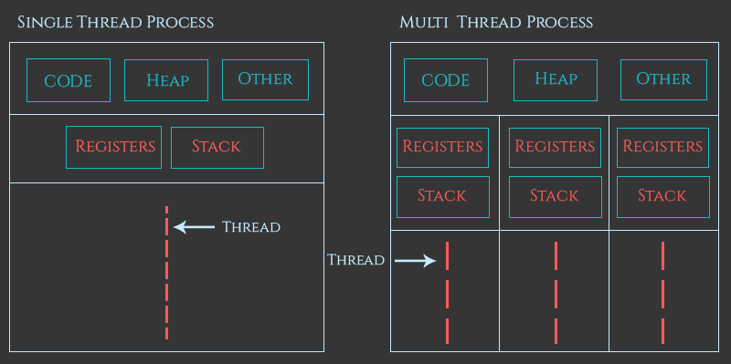


## 2. Fast bin


	 multi thread မဟုတ် or tcache binထဲမရှိရင် fast binကို ကြည့်
	ချက်ချင်းပြန်သုံးလို့ရအောင်လုပ်တာဆိုတော့ fast bin က အမှန်တကယ် free လုပ်ထားတဲ့ကောင်မဟုတ်ဘူး 
	previous chunk နဲ့ coalesce မလုပ်ဘူး fast bin က singly link list (LIFO) နည်းသုံးတယ်
	 ဆိုတော့ chunk တွေထည့်ပြီး ပြန်ထုတ် ရင် အပေါ်ဆုံးကကောင်က စယူတယ် (တစ်ဖက်ပိတ်)
	 ဆိုတော့ fd ဘဲသုံးတယ်
	 fast bin 10ခုရှိတယ် fixed size (same as small bin) တွေဖြစ်တယ်

```
10 Fast bins total:
Bin 0: 16-byte chunks
Bin 1: 24-byte chunks
Bin 2: 32-byte chunks
Bin 3: 40-byte chunks  
Bin 4: 48-byte chunks
Bin 5: 56-byte chunks
Bin 6: 64-byte chunks
Bin 7: 72-byte chunks
Bin 8: 80-byte chunks
Bin 9: 88-byte chunks

88 bytes အထက်ဆိုရင် fast bin မဟုတ်တော့ အခြားbinရှာ
```


## 3. Small Bin
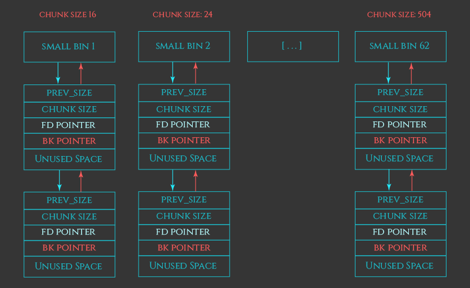

	
	number of bins = 62 (each contain from 6 bytes to 512 bytes in 32bit system and  32 bytes to 1024 bytes in 64 bit system) and fixed sized ဖြစ်တယ် doubly linked list (Fist in Fisrt Out) အရင်ဝင်တဲ့ကောင် အရင်ထွက်တယ် ဆိုတော့ fd bk နှစ်ခုလုံးသုံးတယ် Coalescing လုပ်တယ်


## 4. Unsorted Bin 


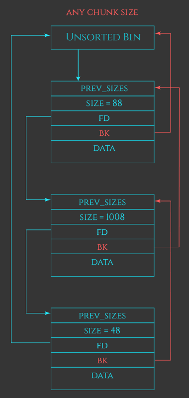

	ptmalloc2 ရဲ့ optimizing cache layer ။ 
	1 bin ထဲဘဲရှိတယ် free chunk တွေကို neighbour chunkတွေနဲ့ coalesces လုပ်တယ် temporary အနေနဲ့ဘဲသုံးတယ် လိုအပ်တဲ့ size နဲ့ ကိုက်ညီရင် split လုပ်ပြီး ယူတယ် မကိုက်ရင် ဒီ chunk ကို small/large bin ထဲ ပြန်ထည့်တယ်။ circular ပုံစံဖြစ်တယ် doubly linked list ဖြစ်တယ်
	 no sorting ဆိုတော့ ရှာရမြန်တယ်  Small bins လို Fixed size order Large bins လို Sorted by size မဟုတ် use both fd and dk


## 5. large bin

	512 bytes (1024 bytes on 64-bit) ထက်ကျော်ရင် large bin ထဲသိမ်း
	bin 63 ခုရှိ ဒီမှာ binတစ်ခုစီမှာက fixed size မဟုတ်တော့ဘူး range နဲ့သွားတယ်
	 bin တစ်ခုချင်းစီမှာ chunk တွေကို ငယ်စဉ်ကြီးလိုက်စီထားတယ်
	 
```
Large Bin 64 (512-576 bytes):
┌─────────────────┐
│    512 bytes    │ ← Chunk A (smallest in range)
├─────────────────┤
│    540 bytes    │ ← Chunk B (within range)
├─────────────────┤
│    576 bytes    │ ← Chunk C (largest in range)
└─────────────────┘

✅ 512-byte chunk ထည့်ရ
✅ 540-byte chunk ထည့်ရ
✅ 576-byte chunk ထည့်ရ
❌ 577-byte chunk မထည့်ရ (goes to next bin)
```


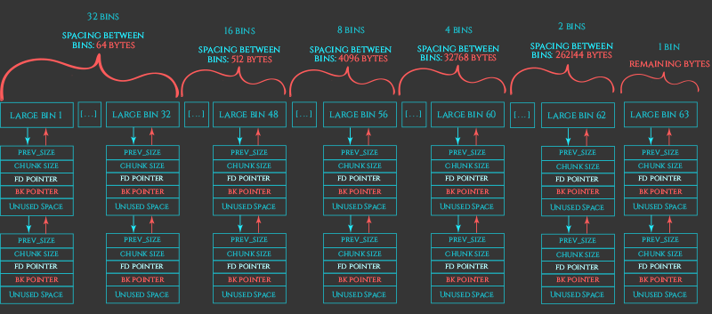

---

# Common Vulnerabilities

```
Pwngdb Commands to see heap flow:

heap
bins
vis
arena
arenas
f4
ptype user
dq &user
p user


# Pwndbg heap commands
heap               # Heap overview
arena              # Arena information
chunk $rax         # Inspect chunk at address
bins               # Show all bins (fast, unsorted, small, large)
fastbins           # Fastbins only
unsortedbin        # Unsorted bin
smallbin           # Small bins
largebin           # Large bins
tcachebins         # Tcache bins (glibc 2.26+)
tracemalloc        # malloc hook tracing

# Example heap debugging
gdb-pwndbg$ heap
gdb-pwndbg$ bins
gdb-pwndbg$ chunk 0x555555559000
```


### Double free

free နှစ်ခါသုံးမိတာပါ memory တစ်ခုကို allocate ယူပြီး နှစ်ခါ free လုပ်မယ် ပြီး ရင် allocateနှစ်ခါ ယူရင် အစောက memory ‌addressကိုနှစ်ခါပေးမိသွားတယ် ဆိုတော့ memory addressတူ pointer နှစ်ခုရတယ် pointer တစ်ခုကို ဖျက်ပီး နောက် pointer ကို data ထည့်လို့ရတယ် free chunk ကို edit လုပ်လို့ရတဲ့သဘောဖြစ်သွားမယ်။ 
You can see example : https://guyinatuxedo.github.io/27-edit_free_chunk/double_free_explanation/index.html

### Heap Consolidation

Chunk 3 ခု allocate ယူမယ်  first chunk ကို free and pointer ကို ရှင်း ။ တတိယchunkကို prev_in use ဖြုတ် prev in size ( chunk 1+ chunk2) ထည့်   ပြီးရင် free လိုက်။ chunk2 ကနေရင်းထိုင်ရင်း free သလို ဖြစ်သွား( not actually free) ။ နောက် ထပ် chunk နှစ်ခုထပ်ယူ (chunk 4 and chunk5) chunk 2 pointer နဲ့ chunk 5 pointer တူနေ။ chunk 2 ကို free လုပ် pointer ရှင်း but chunk5 pointer ကနေ data edit လုပ်လို့ရ။
You can see example : https://guyinatuxedo.github.io/27-edit_free_chunk/heap_consolidation_explanation/index.html


### Use After Free

chunk ကို free လုပ်ခဲ့တယ် but  ptr ကို မရှင်းခဲ့ဘူး ဆိုတော့ ptr ကို သုံးပြီး free chunk မှာ data ထည့်လို့ရတယ်
you can see example : https://guyinatuxedo.github.io/27-edit_free_chunk/uaf_explanation/index.html


### Unlink() Exploit

unlink() က ဘာလုပ်တာလဲဆို memory allocate လုပ်တဲ့အခါ bin ထဲက free chunk ကို ထုတ်ပေးတာ။ ဥပမာအနေနဲ့ ပြောရရင် free chunk သုံးခုရှိတယ် အလယ်ကကောင်ကို ထုတ်မယ်ဆိုရင် ထုတ်မယ့်ကောင်ရဲ့ fd နဲ့ bkကို ကျန်တဲ့နှစ်ကောင်ကိုချိတ်ဆက်ပေးမယ်။ ဆိုတော့ အရင်ဆုံး အဲကျန်တဲ့နှစ်ကောင် ရဲ့  (previous chunk ရဲ့  fd နဲ့  next chunk ရဲ့ bk ) pointerတွေက ငါတို့ထုတ်မယ့်ကောင်ကို point လုပ်နေလားဆိုတာစစ်တယ်
ဒီနေရာမှာ သတိထားရမှာက fd နဲ့ bk က other chunk ကို ရည်ညွှန်းတဲ့ အခါ metadata စတဲ့ memory address ကိုဘဲ pointလုပ်တယ် user data မဟုတ်ဘူး ဒီအချက်ကိုမသိတော့ နည်းနည်း လည်သွားတယ် :)) 
ဒီ example မှာက chunk1  memory address (user data address) ကို target global variable  ထဲထည့်မယ်
ပြီးရင်  chunk 1 ကို free chunk ဖြစ်အောင် ပြင်မယ်  user data အစကို chunk အစ ဖြစ်အောင်လုပ်မယ်။      
ဆိုတော့ target address က  chunk အစကို point လုပ်သလိုဖြစ်သွားမယ် fd နဲ့ bk point လုပ်သလိုပေါ့။ chunk 1ဘက်ပြန်လှည့်ကြည့်ရအောင် chunk1 ကို  user data အစဖြစ်အောင် ပြင်တယ် အဲမှာ prev size ထားမယ် 0တွေပေါ့ နောက်ထပ် 8 byte ဆင်းပြီး chunk size ကိုယ့်ဘာသာထည့်မယ် 0xa ပေါ့ ငါတို့က 0xa ကို malloc ကနေတောင်းခဲ့တယ် ဆိုတော့ ဒီအတိုင်းကောက်ထည့်လို့အဆင်ပြေတယ် fd နဲ့ bk ကိုထည့်မယ် bkက အစောက target ‌address ရဲ့ အပေါ် 0x10 ( 16 bytes) အကွာကို ရည်ညွှန်းမယ် အဲကနေ fd တွက်ရင် target address ရောက်အောင်လို့ ဒါမှ target chunk ရဲ့ fd က chunk ကို point လုပ်နေမယ်  chunk 1 ရဲ့ fd ကိုလည်း ဒီtrick သုံးပြီးလုပ်မယ် 

chunk1 ကို bin ထဲက free chunk မှန်းသိအောင် chunk 2 ရဲ့  prev  size ကို chunk 1 size ထည့်မယ်။
chunk2 ကို free လုပ်လိုက်ရင် free chunk1 နဲ့ chunk2 ပေါင်းဖို့ unlink() function ကို trigger လုပ်မယ်
ပုံမှန် binထဲကထုတ်မယ်ဆိုရင်    (binထဲကထုတ်မယ့် chunk က chunkA ဆိုပါစို့) chunk Aကို bin ထဲကထုတ်မယ်ဆိုရင် chunkA ရဲ့ fd ညွှန်းနေတဲ့ FD chunk ကိုအရင်သွားကြည့်ပြီး  FD chunk ရဲ့ bk (chunk Aကိုညွှန်းနေတာ) ကို  chunkA ရဲ့ bkနဲ့ overwrite, ပြီးရင်  chunk Aကို bin ထဲကထုတ်မယ်ဆိုရင် chunkA ရဲ့ bk ညွှန်းနေတဲ့ BK chunk ကိုအရင်သွားကြည့်ပြီး  BK chunk ရဲ့ fd (chunk Aကိုညွှန်းနေတာ) ကို  chunkA ရဲ့ fdနဲ့ overwrite ဆို့တော့ BK process က နောက်မှလာတယ်
ဆိုတော့ အဲ global variable မှာနောက်ဆုံးကျန်ရှိမယ့် value က BK chunk fd ကို ကို overwrite မယ့် global variable အထက် 3ဆ(0x18)အကွာမှာ ရှိနေမယ့် address ဘဲဖြစ်ပါတယ် () global variable - 0x18)


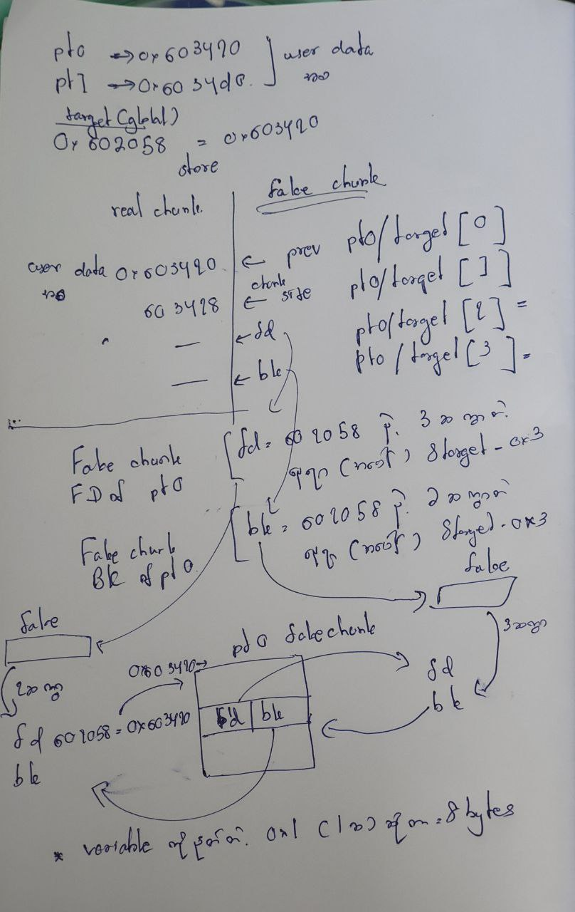

example: https://guyinatuxedo.github.io/30-unlink/unlink_explanation/index.html


### Heap Grooming

3 chunk allocate ယူမယ် free မယ် binထဲ ရောက်သွားမယ် 3 chunk ထည့်ယူမယ် နောက်ဆုံး free တဲ့ memory address က ရှေ့ဆုံးမှာ ရနေမယ် ဆိုတော့ fast binဖြစ်ဖို့များတယ်'
example: https://guyinatuxedo.github.io/26-heap_grooming/explanation_heap_grooming/index.html


---

## NOTES


_note :program တစ်ခုမှာ chunk တစ်ခုရဲ့ metadata ကို ပြင်ချင်ရင်  previous chunk ကို overflow ပြီးမှ  ပြင်လို့ရ code နဲ့ဆိုရင်တော့ chunk_pointer[-1] ( chunk size)  chunk_pointer[-2] (previous_size) ဆိုပြီး accessလုပ်ပြီးပြင်လို့ရ


# Challenges


### Heap2

```
──(Jackfruit㉿kali)-[~/…/learn/binary/stack/liveOverFLow]
└─$ file heap2_32 
heap2_32: ELF 32-bit LSB executable, Intel i386, version 1 (SYSV), dynamically linked, interpreter /lib/ld-linux.so.2, BuildID[sha1]=ae1eca6c4c9c285f6d3443901009deb1d345a62c, for GNU/Linux 3.2.0, not stripped
                                                                                                                                                             
┌──(Jackfruit㉿kali)-[~/…/learn/binary/stack/liveOverFLow]
└─$ pwn checksec heap2_32 
[*] '/home/Jackfruit/cate/learn/binary/stack/liveOverFLow/heap2_32'
    Arch:       i386-32-little
    RELRO:      Partial RELRO
    Stack:      No canary found
    NX:         NX unknown - GNU_STACK missing
    PIE:        No PIE (0x8048000)
    Stack:      Executable
    RWX:        Has RWX segments
    Stripped:   No
                                                                                
```

```c
#include <stdlib.h>
#include <unistd.h>
#include <string.h>
#include <sys/types.h>
#include <stdio.h>

struct auth {
  char name[32];
  int auth;
};

struct auth *auth;
char *service;

int main(int argc, char **argv)
{
  char line[128];

  while(1) {
    printf("[ auth = %p, service = %p ]\n", auth, service);

    if(fgets(line, sizeof(line), stdin) == NULL) break;
    
    if(strncmp(line, "auth ", 5) == 0) {
      auth = malloc(sizeof(auth));
      memset(auth, 0, sizeof(auth));
      if(strlen(line + 5) < 31) {
        strcpy(auth->name, line + 5);
      }
    }
    if(strncmp(line, "reset", 5) == 0) {
      free(auth);#####1
    }
    if(strncmp(line, "service", 6) == 0) {
      service = strdup(line + 7);#####3
    }
    if(strncmp(line, "login", 5) == 0) {
      if(auth->auth) #####2{
        printf("you have logged in already!\n");
      } else {
        printf("please enter your password\n");
      }
    }
  }
}
```


	#####1 နေရာမှာ free သုံးတယ် ပီးတော့ pointer ကိုမရှင်းခဲ့ဘဲနဲ့ #####2 auth->auth အရင် pointer ဟောင်းကိုဘဲပြန်သုံးပြီး checkလုပ်တယ် -> syntax နဲ့ pointer ကနေ တစ်ဆင့် struct member ကို access လုပ်လို့ရတယ် (*ptr).member နဲ့အတူတူဘဲ 
	#####3 strdup ကို memory အသစ်ယူပြီး copy ကူးထည့်ပေးတယ် ဆိုတော့ free လုပ်ပီး service ယူရင် auth heap address ကိုဘဲပြန်သုံးမယ် service ကို struct ထဲက auth ရောက်မယ့် offset ထိရောက်အောက်ယူပြီး loginဝင် auth->auth check passsed!


---
## Unlink Exploit:
## stkof

```
└─$ pwn checksec stkof
[*] '/home/Jackfruit/cate/learn/binary/heap/nightmare/modules/30-unlink/hitcon14_stkof/stkof'
    Arch:       amd64-64-little
    RELRO:      Partial RELRO
    Stack:      Canary found
    NX:         NX enabled
    PIE:        No PIE (0x3fe000)
                                     
```

main ကို တစ်ချက်ကြည့်လိုက်ရင် menu 4 ခုတွေ့မယ်
1 - allocate chunk
2 - scan data
3 -  free function
4 -  print data 

ဆိုတော့ သူကတော့ menu prompt ပေးမထားဘူး
main function ဖတ်ရင်တော့တွေ့ရလိမ့်မယ်

	Allocate function
```c
  fgets(local_78,0x10,stdin);
  __size = atoll(local_78);
  ptr = malloc(__size);
  if (ptr == (void *)0x0) {
     uVar1 = 0xffffffff;
  }
  else {
     DAT_00602100 = DAT_00602100 + 1;
     *(void **)(&DAT_00602140 + (long)(int)DAT_00602100 * 8) = ptr;
     printf("%d\n",(ulong)DAT_00602100);
     uVar1 = 0;
  }
```

	ဒီနေရာမှာ user ပေးလာတဲ့ input ကို ဘဲ တစ်ခါတည်း size လုပ်ပြီးတန်းယူတာ check မလုပ်ဘူး 
	DAT_00602100 ဒီကောင်က index ပေးတာ allocate ယူတိုင်း index တစ်ခုတိုးတိုးပေး
	(void **)(&DAT_00602140 + (long)(int)DAT_00602100 * 8) = ptr; ဒီ code က
	ဘာလုပ်လဲဆို heap ထဲက user data address pointer ကို global variable ထဲမှာ သိမ်း
	ပြီးရင် index ထုတ်ပြ printf("%d\n",(ulong)DAT_00602100);


	Scan function
```c
  fgets(user_input,0x10,stdin);
  index = atol(user_input);
  if ((uint)index < 0x100001) {
     if (*(long *)(&DAT_00602140 + (index & 0xffffffff) * 8) == 0) {
        return_address = 0xffffffff;
     }
```

	စစချင်း  user index တောင်းမယ်
	ငါတို့အစောက စခဲ့တဲ့ DAT_00602100 ကို index တွက်ပြီး မင်းတောင်းတဲ့ index မှာ heap address ရှိမရှိစစ်မယ်

```c
     else {
        fgets(user_input,0x10,stdin);
        size = atoll(user_input);
        data_address_on_heap = *(void **)(&DAT_00602140 + (index & 0xffffffff) * 8);
        while( true ) {
           user_data_from_heap = fread(data_address_on_heap,1,size,stdin);
           user_data_from_heap(int) = (int)user_data_from_heap;
           if (user_data_from_heap(int) < 1) break;
           data_address_on_heap = (void *)((long)data_address_on_heap + (long)user_data_from_heap(int))
           ;
           size = size - (long)user_data_from_heap(int);
        }
        if (size == 0) {
           return_address = 0;
        }
```
	heap address ရှိရင် size တောင်းမယ်
	ပြီးရင် အစောက index သုံးပြီး heap addressယူမယ်

```c
while( true ) {
    // 1. stdin ကနေ data ဖတ်တယ်
    user_data_from_heap = fread(data_address_on_heap, 1, size, stdin);
    
    // 2. ဘယ်လောက် bytes ဖတ်လဲဆိုတာ integer အဖြစ်ပြောင်း
    user_data_from_heap(int) = (int)user_data_from_heap;
    
    // 3. ဖတ်လို့မရတော့ရင် break
    if (user_data_from_heap(int) < 1) break;
    
    // 4. pointer ကို ရွှေ့ (ဖတ်ပြီးသား data ရဲ့ နောက်တစ်နေရာကို)
    data_address_on_heap = (void *)((long)data_address_on_heap + (long)user_data_from_heap(int));
    
    // 5. ကျန်သေးတဲ့ size ကို update
    size = size - (long)user_data_from_heap(int);
}
```


---

# Fastbin attack :
## 0ctf baby heap

အချို့ heap exploit တွေက နောက်ပိုင်း version တွေမှာအလုပ်မလုပ်တော့ဘူး
ဆိုတော့  default glibc version မသုံးအောင် program ရဲ့  elf setting ကို ပြင်မယ်


```
patchelf --set-interpreter ~/glibc/glibc_2.23/ld-2.23.so 0ctfbabyheap
patchelf --set-rpath ~/glibc/glibc_2.23/ 0ctfbabyheap
```

ဒီ program မှာ မစခင် သိထား ဖို့က

fast bin တွေက 
	- **32-bit systems** မှာ16 bytes ကနေ 80 bytes အထိ (default malloc chunk alignment နဲ့)
	- 64-bit systems မှာ32 bytes ကနေ 160 bytes အထိ ဆို fast bin ထဲဝင်တယ်
	- chunk တစ်ခု fast bin တွေ ဝင်သွားရင်  next chunk က လက်ရှိ free chunk in fast bin ကို prev in use လို့ သဘောထားထားတယ် (ဘာလို့ဆို fast binတွေကို ချက်ချင်းပြန်သုံးနိုင်အောင်လုပ်ထား)
fast bin attack တွေက
	same chunk ကို မှ pointer နှစ်ခု ထောက်နိုင်အောင်လုပ်ပီး တစ်ခု က allocate နောက်တစ်ခုက free ထား ဆိုတော့ bin ထဲကကောင်ကို data ထည့်နိုင်အောင်လုပ်
   
unsorted bin တွေမှာ
	 free chunk တစ်ခုထဲဆို အဲ free chunk က main_arena +88 ကို fd ရော bk ရော pointလုပ်

malloc ခေါ်တဲ့အခါ
	malloc က `__malloc_hook` null ဖြစ်မဖြစ် check တယ် null မဟုတ်ဘဲ hook set ထားရင် အဲ addressကို ခေါ်


ဆိုတော့ general exploit က  unsorted bin ထဲက address ကို leak , libc base address တွက်, shell execution address ကို တွက် `__malloc_hook` မှာထား malloc နောက်ထပ်ခေါ်ရင် shell ရ

ဒီမှာ ပုံသေ သတ်မှတ် ထားရမယ် allocation technique တစ်ခုရှိတယ်

```

allocation part 1

[1] 0xf0 (240)
[2] 0x70 (112)

နဲ့

allocation part 2
[1] 0x10 (16)
[2] 0x60 (96)
[3] 0x60 (96)
[4] 0x60 (96)

မှာက first allocation part 1 က chunk2 pointer နဲ့ ‌allocation chunk4 pointer တို့က အတူတူ ဘဲ ဒီ technique ကို သုံးပြီး fast bin အတွက် pointer နှစ်ခုဖြစ်အောင်လုပ်လို့ရတယ်

```

ဒီနေရာမှာ program က index နဲ့မမှားစေနဲ့ သဘောတရားနားလည်အောင် chunk 1,2,3 ... ရေးထား
ဆိုတော့ 
 
```
allocation part 1
[1] 0xf0 (240)
[2] 0x70 (112)
[4] 0xf0 (240)
[5] 0x30 (48)
```
	ဆိုပီး chunk 4ခုယူမယ်
	1 နဲ့ 2 ကို free လုပ်လိုက်မယ် 
	1 က unsorted binထဲရောက်သွားမယ် 2 က fast bin ထဲရောက်
	နောက်ထပ် chunk တစ်ခုထပ်ယူမယ် 0x78 (120) ယူမယ် free လုပ်ထားတဲ့ 2 ကို ပေးလိမ့်မယ် ဘာလို့ 8 ယူလဲဆို chunk တွေရဲ့နောက်ဆုံး၎င်းမှာ next chunk အတွက် prev size( prevous chunk free ပါကထည့်ပေးဖို့) ထည်ဖို့ 8 bytes ပေးတာရှိတယ်next chunk က prev size မထည့်ရင်တော့ current chunk အပိုင်ဘဲအဲနေရာက user data ထည့်လို့ရ ။ အဲကြောင့် 8 byte ပိုယူလို့ရ -> fast bin ထဲကကောင်ကိုရ။
	ဒီ program မှာ fill လုပ်မယ်ဆို fill မယ် size တောင်းတယ် ငါတို့ fill ချင်သလောက်ရ ဆိုတော့ 8 byte ပိုယူမယ် (128) ဘာလို့ဆို next chunk ရဲ့ meta data ကိုပြင်ချင်လို့ ဘယ်လိုပြင်ချင်လဲဆို လက်ရှိ  chunk no  2 ကို free chunk လို့မြင်အောင် chunk no 1 နဲ့ ပေါင်းထားတယ်လို့မြင်အောင်ပြင်မယ် prev size ထည့် prev in use last bit 1ကို 0 ထား 
	လုပ်ပီးရင် chunk no 3ကို free လုပ်လိုက်ရင် အပေါ်ကကောင်တွေနဲ့ ပေါင်း ပြီး unsorted bin ထဲရောက်
	chunk 2 pointer က access လုပ်လို့ရ program မှာ dump function ပါတော့ data ကိုကြည့်လို့ရ , ဒီကောင်က unsorted binထဲရောက်နေတာဆိုတော့ data အနေနဲ့ fd နဲ့ bk ကို ကြည့်လို့ရ , main_arena +88 address leak လို့ရ chunk 2 pointer က အလယ်ရောက်နေတာဆိုတော့ အဆင်မပြေသေး, ဆိုတော့ chunk 1 ကိုသုံးအောင် malloc(240) ထပ်ယူ unsorted bin က split ပေး ။ ဆိုတော့ chunk 2 pointer အထပ်ရောက် address leak လို့ရ

Calculation
	ရလာတာက `[main_arena + 88(0x58)] address`
	 `[main_arena + 88(0x58)] address` -0x58 ဆို main_arena address ရ

```
Libc ELF File Structure:
┌─────────────────────────┐
│ .text section           │ ← Code (functions တွေရဲ့ machine code)
│   ├── malloc() code     │
│   ├── free() code       │
│   └── system() code     │
├─────────────────────────┤
│ .data section           │ ← Initialized global variables
├─────────────────────────┤
│ .bss section            │ ← UNinitialized global variables
│   ├── __malloc_hook     │ ← အရေးကြီးပါ!
│   ├── __free_hook       │
│   └── main_arena        │
├─────────────────────────┤
│ .rodata section         │ ← Read-only data (strings)
│   └── "/bin/sh" string  │
└─────────────────────────┘
```

	`__malloc_hook` ကို main_arena ထက် 0x10 bytes ပို နီး 
	ဆိုတော့  `[main_arena + 88(0x58)] address` -0x68 ဆို __malloc_hook address ရ
		ဆိုတော့  `[main_arena + 88(0x58)] address` -0x68 - (__malloc_hook offset from libc base)address ဆို libc base addressရ


```
┌──(Jackfruit㉿kali)-[~/glibc/glibc_2.23]
└─$ one_gadget libc-2.23.so 
0x3f6be execve("/bin/sh", rsp+0x30, environ)
constraints:
  address rsp+0x40 is writable
  rax == NULL || {rax, "-c", r12, NULL} is a valid argv

0x3f712 execve("/bin/sh", rsp+0x30, environ)
constraints:
  [rsp+0x30] == NULL || {[rsp+0x30], [rsp+0x38], [rsp+0x40], [rsp+0x48], ...} is a valid argv

0xd6701 execve("/bin/sh", rsp+0x50, environ)
constraints:
  [rsp+0x50] == NULL || {[rsp+0x50], [rsp+0x58], [rsp+0x60], [rsp+0x68], ...} is a valid argv

```
	one_gadget ကိုသုံးပြီး shell execute မယ့် address ရဲ့ offset ရ, libc base addressနဲ့ပေါင်းပြီး  shell execute မယ့် address ရ

#### allocation part 2

	ဆိုတော့ အပေါ်က ပြထားတဲ့အတိုင်း allocation part2အတိုင်း allocate ယူမယ်
	[4] 0x60 (96) ဒီကကောင်နဲ့ အပေါ်က poninter နဲ့က တူတူဘဲ 


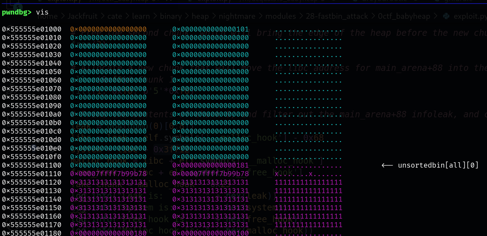


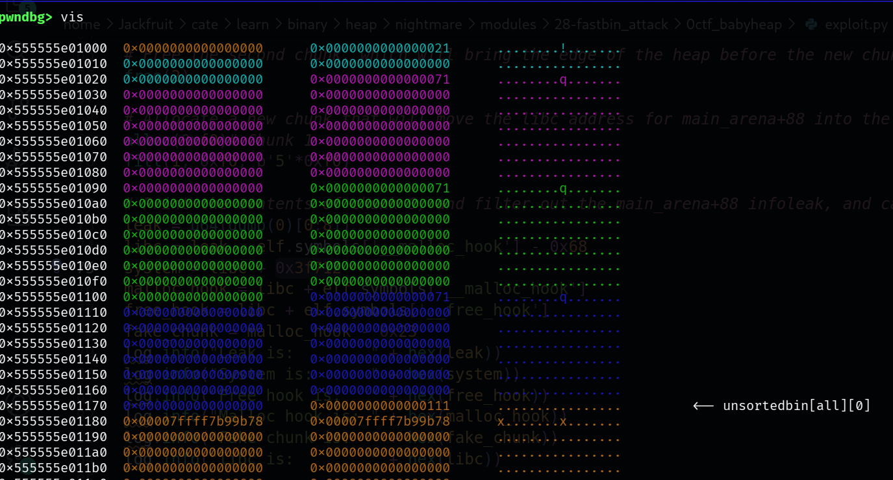

	0x555555e01100 ဘဲ သွားကျနေတယ် part 1က  pointer က free မလုပ်လိုက်ဘူးဆိုတော့သုံးလို့ရယ်
	ဒီနေရာမှာ သူ့ index ကို သုံးလို့ရသေးတယ်ပေါ့ nightmare မှာ index 0 , part 2 ကလည်း index ထပ်ပေး (index 5)
	
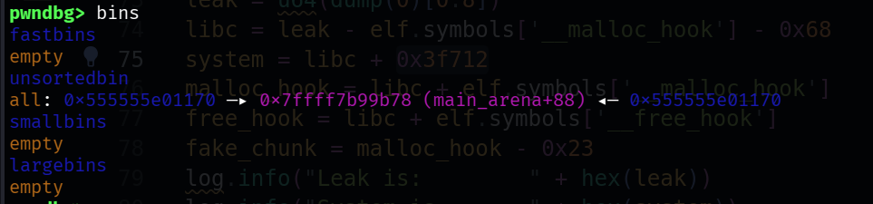


	fast bin ထဲမှာလည်း ဘာမှ မရှိသေး ဆိုတော့ fast bin attack လုပ်ဖို့ fast binထဲထည့်ရမယ် index0 , index5 ptr နှစ်ခု လုံးကို ထည့်ရမယ် ပြီးရင် index တစ်ခုကို allocate ယူ ဆိုတော့ ptr တစ်ခုက allocate , ptr တစ်ခုက free , ‌allocat ထားတဲ့ ptr ကို သုံးပြီး data ထည့် , free လုပ်ထားတဲ့ ptr ကို data ထည့်သလိုဖြစ်သွား ,cuz both pointers have the same memory address, 
	ဆိုတော့ fast bin ထဲကို ptrတွေထည့်မယ် ဒါမဲ့ bin ထဲမှာ နှစ်ခုလုံး တစ်ဆက်တည်းဖြစ်လို့မရဘူး ကြားခံထားပြီးထည့်မယ် index 4ကိုသုံးမယ်

	ဆိုတော့ 
```
free(5)
free(4)
free(0)
```
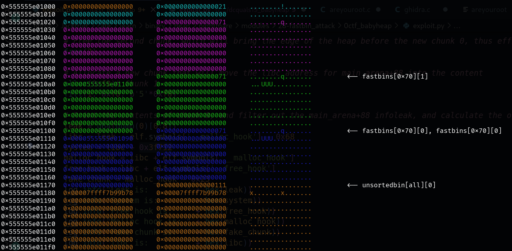


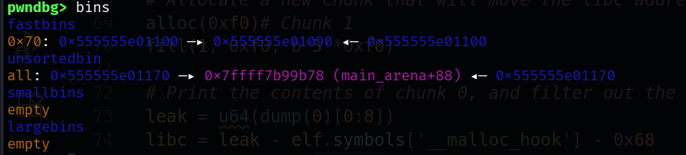


	ပြီးရင် allocate 0x60(96) နှစ်ခါယူမယ်  fast  binထဲကကောင်တွေနဲ့ size ကိုက်တော့ binထဲကကောင်တွေနဲ့ဘဲသုံးမယ် binထဲကနှစ်ကောင်ယူမယ် fast bin က fast in last out ဆိုတော့ နောက်ဆုံးထည့်ကောင်ကစယူမယ် 0 ယူ ပြီးရင် 4 ယူ ဆိုတော့ ဒီနေရာမှ fast bin exploit စလို့ရပီ same ptr , ptr တစ်ကောင်က binထဲမှာ တစ်ကောင်က allocate, allocate ဖြစ်ထားတဲ့ ptrကောင်ကို သုံးပြီး data ထည့်မယ် (binထဲကကောင်ဆိုerror တက်မယ် binထဲကကောင်ပါဆို မှ data ထည့်လို့မှမရတာ) 
	ဒီနေရာမှာ ဘာထည့်မှာလဲဆို fd ဖြစ်မယ့်ကောင်ကိုထည့်မယ် fast binတွေက fdတွေဘဲသုံး 
	fd တွေက binထဲကကောင်တွေကို ရည်ညွှန်းနေတာဆိုတော့ fd ကို memory address တစ်ခုခု ထားလိုက်ရင် အဲ address က binထဲကကောင်ဖြစ်သွားမှာ  နောက်ထပ် allocate ထည့်ယူရင် အဲ address ကိုယူမယ်ဆိုတော့ အဲ address ကို data ထည့်လို့ရသွားမယ် ငါတို့က __maloc_hook ကို overwrite ချင်တာဆိုတော့ __malloc_hook မတိုင်ခင်က address ကို fdနေရာထားလိုက်ရင် __malloc_hook ကိုoverwite လို့ရသွားမယ်မလား
		ဆိုတော့ __malloc_hook - x023 (35) address ကို fd နေရာထားမယ် allocate ယူ,binထဲမှာ __malloc_hook - x023 (35) address ကျန်ခဲ့ အဲaddress က chunk အစ, ဘာလို့ဆိုfd တွေက chunk အစကို ဘဲ point လုပ်လို့, allocate ထပ်ယူရင် အဲ address ရ, data ထည့်လို့ရ chnksize 35 -metadata (16) = 19 (data ထည့်စတဲ့နေရာကနေ __malloc_hook addressရဲ့အကွာအဝေး)
		ဆိုတော့ 19 + __malloc_hook ကို overwirte မယ် 8 bytes address(shell execute address) = 27 ထည့်မယ် fill funtion ကိုchoose လိုက်ပီးထည့်လိုက်မယ်ဆို overwite ပြီးသားဖြစ်
		နောက်ထပ် chunk allocate တစ်ခုထပ်ယူ , mallocက __malloc_hookကို check လိုက်တဲ့အချိန်မှာ BOoooom! shell ရ ။


---


## Auir

```
# Binary ရဲ့ interpreter (linker) ကို ပြောင်းမယ်
patchelf --set-interpreter ./ld-2.31.so ./challenge

# Binary ရဲ့ libc ကို ပြောင်းမယ်
patchelf --replace-needed libc.so.6 ./libc-2.31.so ./challenge

# Run မယ်
./challenge
```

**Error က ပြောနေတာက: "မင်း [libc-2.23.so](https://libc-2.23.so) ထဲမှာ ကျွန်တော်လိုအပ်တဲ့ features တွေ မပါဘူး"**

## **Error ကို ရှင်းပြချက်:**

text

./auir: ./libc-2.23.so: version `GLIBC_2.38' not found (required by /lib/x86_64-linux-gnu/libstdc++.so.6)

- `libstdc++.so.6` (C++ standard library) က `GLIBC_2.38` version symbol ကို လိုအပ်တယ်
    
- ဒါပေမယ့် မင်း `libc-2.23.so` ထဲမှာ ဒီ symbol မရှိဘူး
    
- ဘာလို့လဲဆိုတော့ glibc 2.23 က 2016 ကဖြစ်ပြီး၊ GLIBC_2.38 က 2023 မှထွက်တာ
    

## **ဘာကြောင့်ဖြစ်ရတာလဲ:**

မင်း system မှာ **modern libraries** တွေ install လုပ်ထားတယ်:

1. `libstdc++.so.6` - C++ library (new, needs glibc 2.38)
    
2. `libm.so.6` - Math library (new, needs glibc 2.36)
    
3. `libgcc_s.so.1` - GCC runtime (new, needs glibc 2.35)
    

ဒီ libraries တွေက compile လုပ်တုန်းက **new glibc features** တွေသုံးထားတယ်။ မင်း `LD_PRELOAD` နဲ့ old libc (2.23) ကို load လုပ်လိုက်တော့၊ ဒီ new features တွေကို မတွေ့တော့ဘူး။

---


# 0ctf 2016 - Zerostorage


	ဒီမှာ Merge ဆိုတာပါလာတယ် Insert function chunk ယူတဲ့အခါ 0x80 ထက်ငယ်ရင် 0x80 ဘဲ user
	data ယူတယ် အဲတော့ ငါတို့ free လုပ်လိုက်ရင် unsorted binထဲရောက်ရောက်သွားမယ် fast bin
	attack မရအောင်လုပ်ထားတယ်ပေါ့ ငါတို့ bypass လုပ်ရမယ် ဘယ်လိုလဲဆို porgram ရဲ့ 0x80အတွင်းဘဲ fast bin ထဲကို ထည့်မယ်ဆိုတဲ့ logic ကိုပြင်ရမယ် logic ဆိုတာက code နဲ့ရေးထားတာပေါ့ 0x80 နဲ့ check လုပ်တာကို ပြင်ရမယ် 0x80 ကို global_max_fast ဆိုတဲ့ variable ဘဲထည့်ထားတယ် ဒီကောင်က mallo() implementation ထဲမှာ  fastbin size limit ကို သတ်မှတ်ပေးတယ် global_max_fast ရှိတယ် အဲကောင် က libc data section ထဲမှာရှိတယ်။ 
	 ပြီးတော့ Delete function မှာ double free, use after
	free protection ပါတယ် ဆိုတော့ ခါတိုင်းလို free chunk ယောင်ယောင် allocated chunk ယောင်ယောင်နဲ့ chunk ကိုပြင်လို့မရတော့ဘူး ဒီမှာ Bug ရှိတာက Merge function , ဘာလုပ်တာလဲဆို from နဲ့
	to ရှိတယ် from chunk ထဲက data ကို to နဲ့သွားပေါင်းပြီး index တစ်ခုပေး from ထဲကကောင်ကို
	unsorted bin ထဲထည့်တယ်
	so think about it.... how to expoit??

	ဒါက delete funtion ထဲက ဘယ်လို protection လုပ်ထားလဲဆိုတာ
	 1. Used Flag ကို 0 ပြန်လုပ်ခြင်း
```c
	(&flag_1_or_not)[lVar3 * 6] = 0;  // ဒီ line က UAF ကာကွယ်ဖို့```
```
	Free လုပ်ပြီးတာနဲ့ used flag ကို 0 ပြန်လုပ်လိုက်တယ်။  
	ဒါကြောင့် View(), Update(), Merge() function တွေကို ခေါ်ရင်
```c
if ((&flag_1_or_not)[index * 6] == 1)  // condition fail ဖြစ်မယ်```
```
	Result: Freed chunk ကို access လုပ်လို့မရတော့ဘူး။

	2. XORed Pointer ကို 0 ပြန်လုပ်ခြင်း
```c
	(&DAT_00303070)[lVar3 * 3] = 0;  // pointer ကို 0 လုပ်တယ်
```
	ဒီလိုလုပ်လိုက်တာကြောင့်:
	- View() → `0 ^ GLOBAL_KEY = GLOBAL_KEY` → invalid address
	- Update() → အလားတူ invalid address
	- Merge() → အလားတူ


	ဆိုတော့ စလိုက်ရအောင်
	 အရင်ဆုံး insert ကို 0x20 နှစ်ခါယူလိုက်တယ် index 0 နဲ့ index 1 ပေးတယ် merge သုံးပြီး from 0 နဲ့ to 0 ပေးလိုက်တယ်  ဆိုတော့ from 0 အနေနဲ့က index 0 က unsorted bin ထဲရောက်သွားပြီး to 0 အနေနဲ့လည်း index0 နေရာ ကို index 2 အနေနဲ့ပေးလိုက်တယ် ဆိုတော့ unsorted bin ထဲကကောင်ကို data access လုပ်လို့ရ data edit လုပ်လို့ရသလိုဖြစ်သွားမယ် view နဲ့ index2ကိုကြည့်လိုက်ရင် fd နဲ့ bk နေရာက main_arena+88 address ကိုရ ထုံးစံအတိုင်း libc တွက်။ ပြီးရင် ငါတို့ overwrite မယ့်ကောင် ရဲ့ offset ရှာပြီဂ address ကိုပါတွက်။ 
	 ဆိုတော့ နောက်တစ်ဆင့်မစခင် fd နဲ့ bk တွေ ဘယ်လိုအလုပ်လုပ်သွားလဲဆိုတာမြင်ဖို့လိုတယ် တကယ် theory ပိုင်းမဟုတ်ဘဲ မျက်လုံးထဲမြင်မှ နောက်တစ်ဆင့် expoit ကို ချက်ချင်းတန်းအဖြေရမှာ
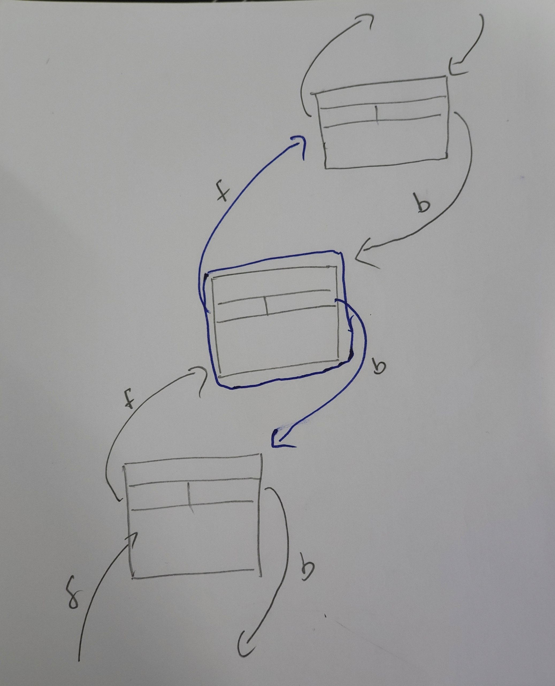


ပုံမှန် bin ထဲက free chunk တစ်ခုစီမှာ သူ့ဆီကထွက်သွားတဲ့မြှားနှစ်ခု ရှိတယ် အပေါ်တစ်ခု အောက်တစ်ခုပေါ့ (ရှေ့နောက်လည်းပြောလို့ရ) သူဆီဝင်တဲ့ မျှားနှစ်ခုလည်း ရှိတယ် အဝင်နှစ်ခု အထွက်နှစ်ခုပေါ့။  ဆိုတော့ပုံမှာအပြဝိုင်းပြထားတဲ့ ကောင်ကို binထဲက ထုတ်မယ်ဆိုရင်  အဲchunk ရဲ့ အဝင်မျှားကို direction တူရာ အထွက်မျှားနဲ့ overwrite လုပ်ပါတယ် ဆိုတော့ ထုတ် လုပ်မယ့်ကောင်ရဲ့ fd ကို value က သူ့အောက်က chunk ရဲ့ fd value ကို overwrite လုပ်ပါတယ် ဆိုတော့ ထုတ် လုပ်မယ့်ကောင်ရဲ့ bk ကို value က သူ့အထက်က chunk ရဲ့ bk value ကို
overwrite လုပ်ပါတယ် 


ဆိုတော့ unsorted binထဲက free chunk တစ်ခုထဲ အခြေအနေ ကိုကြည့်ရအောင်

unsorted ထဲ bin ကိုယ်တိုင်ကလည်း chunk တစ်ခုလိုပါဘဲ unsorted bin က circular doubly linked list ပုံစံနဲ့ရှိလို့ပါ unsorted bin ‌address က main_arena  နဲ့ offset 0x58 အကွာမှာရှိတာပါ အပေါ်က leak ဒါကလည်း unsorted bin address ပါ
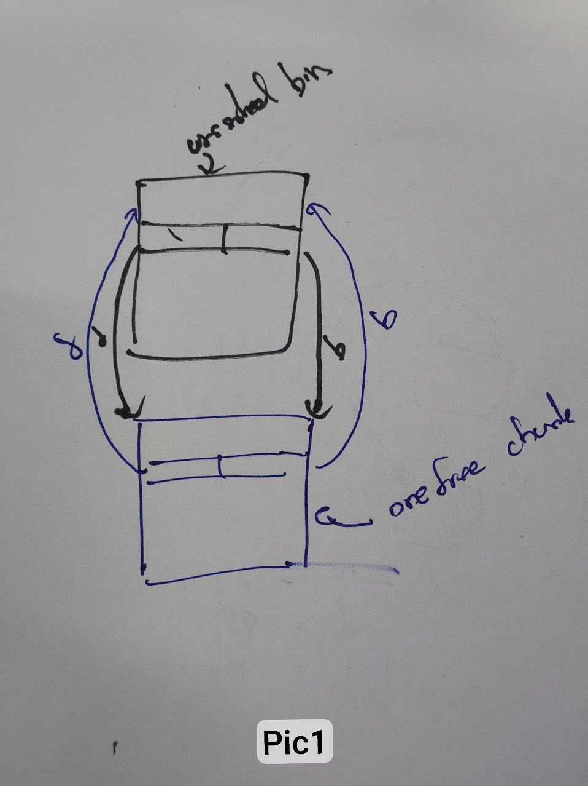


ဆိုတော့ unsorted binထဲ free chunk တစ်ခုရောက်ရင် chunk နှစ်ခုရသလိုဖြစ်ပြီး တစ်ခုကိုတစ်ခု pointer ညွှန်းနေကြတာပါ 

![[zero-5.jpg]]

pic 1နဲ့ pic2 က အတူတူပါ ပိုပြီးရှင်းအောင် မြင်ရတဲ့ ပုံစံပါ 
chunk တစ်ခု ကို free လုပ်ရင် ထုံးစံအတိုင်း မျှားတွေ overwrite ပါမယ် unsorted binနဲ့  free chunk က အချင်းချင်း fd နဲ့ bk နှစ်ခုလုံး point လုပ်နေတာဆိုတော့
unsorted bin ရဲ့ fd နဲ့ bk က binထဲကထုတ်မယ့်  chunk ရဲ့ fd နဲ့ bk တွေ value တွေနဲ့ overwrite ခံရပါမယ်
ဒီနေရာမှာက unsorted binက သူ့ address သူ fd နဲ့ bkမှာရသွားပါတယ်
ဆိုတော့   binထဲကထုတ်မယ့် chunk  fd နဲ့ bk ကို အခြား valueတွေထားပြီး free လုပ်ရင် ဘယ်လိုဖြစ်မလဲ???

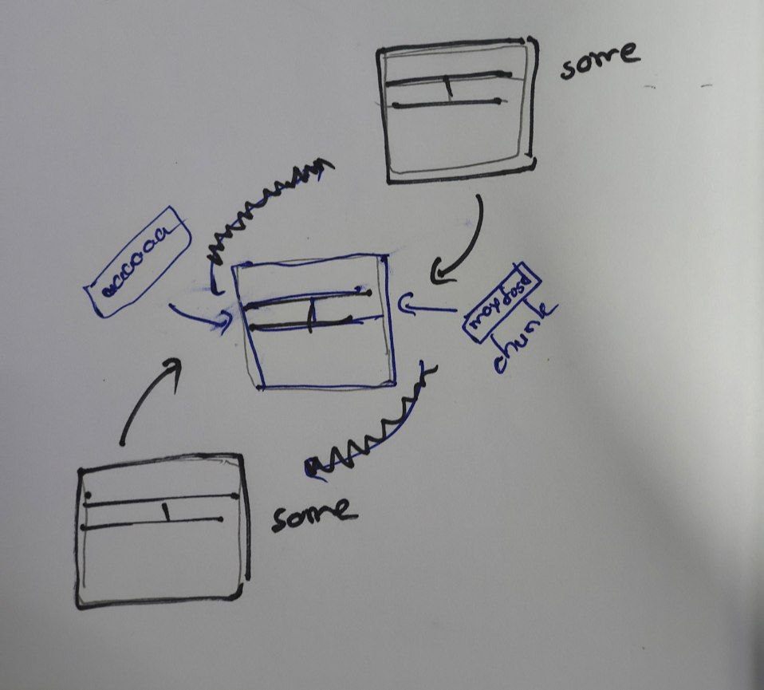


unsorted binရဲ့ fd , bk  value တွေက ငါတို့ချိန်းထားတဲ့ fd bk value တွေ ရသွားမှာပါ
ဒီနေရမှာက ငါတို့ရည်ရွယ်ချက်က global_max_fast ကို large number နဲ့ overwrite မှာဆိုတော့ ဒီကောင်ကို chunk တစ်ခုရဲ့ user data အစ (fd) လိုနေရမှာထားပြီး ဒီကောင်ရဲ့  global_max_fast-0x10 (chunk အစ) ‌address ကို unsorted binရဲ့ bkနေရာဖြစ်အောင်လုပ်လိုက်ရင်  global_max_fast(fd in fake chunk) က unsorted bin value ဖြစ်သွား
ဒီကောင်ကို unsorted binရဲ့ fd လိုနေရမှာ ထားလည်းရတယ် အဲကြ  chunk အစက global_max_fast-0x18 ဖြစ်သွား။ ဘာလို့ဆို global_max_fast ကို fake chunk ရဲ့ fdနေရာရောက်အောင်လို့
![[./pictures/zero-7.jpg]]

ပုံက unsorted bin ရဲ့ fd နေရာထားတဲ့ပုံစံ
ဆိုတော့ နှစ်ခုလုံး test စမ်းကြည့်တော့ ပုံမှာပြထားတဲ့အတိုင်းဘဲအလုပ်ဖြစ်တယ်
ဘာလို့လဲဆိုပြီး ရှာလိုက်တော့
malloc က forward link ကိုမပြင်ဘူး backward link ကိုဘဲပြင်တယ်ပြောတယ်
unlink()မှာတုန်းက (binထဲကထုတ်မယ့် chunk က chunkA ဆိုပါစို့) chunk Aကို bin ထဲကထုတ်မယ်ဆိုရင် chunkA ရဲ့ fd ညွှန်းနေတဲ့ FD chunk ကိုအရင်သွားကြည့်ပြီး  FD chunk ရဲ့ bk (chunk Aကိုညွှန်းနေတာ) ကို  chunkA ရဲ့ bkနဲ့ overwrite, ပြီးရင်  chunk Aကို bin ထဲကထုတ်မယ်ဆိုရင် chunkA ရဲ့ bk ညွှန်းနေတဲ့ BK chunk ကိုအရင်သွားကြည့်ပြီး  BK chunk ရဲ့ fd (chunk Aကိုညွှန်းနေတာ) ကို  chunkA ရဲ့ fdနဲ့ overwrite ဆို့တော့ BK process က နောက်မှလာတယ်
ဒါမဲ့ ဒီနေရာမှာ ဘာလို့ automatically ဖြစ်သွားတာလဲ security check မရှိဘူးလား??????

	ဆိုတော့ exploit အဆင့်တွေပြန်စရအောင်။
	index 2 ကို data ဖြည့်ပြီး bkနေရာ global_max_fast - 0x10 address ဖြစ်အောင်လုပ်
	 နောက်ထပ် chunk ယူရင် binထဲကကောင်ကိုယူ unsorted bin ရဲ့ fd က  global_max_fast - 0x10 address ဖြစ်  global_max_fast ရဲ့ value က 0x80 ကနေ unsorted bin ရဲ့ addressဖြစ်
	 unsorted bin က corrupt ဖြစ်သွား


